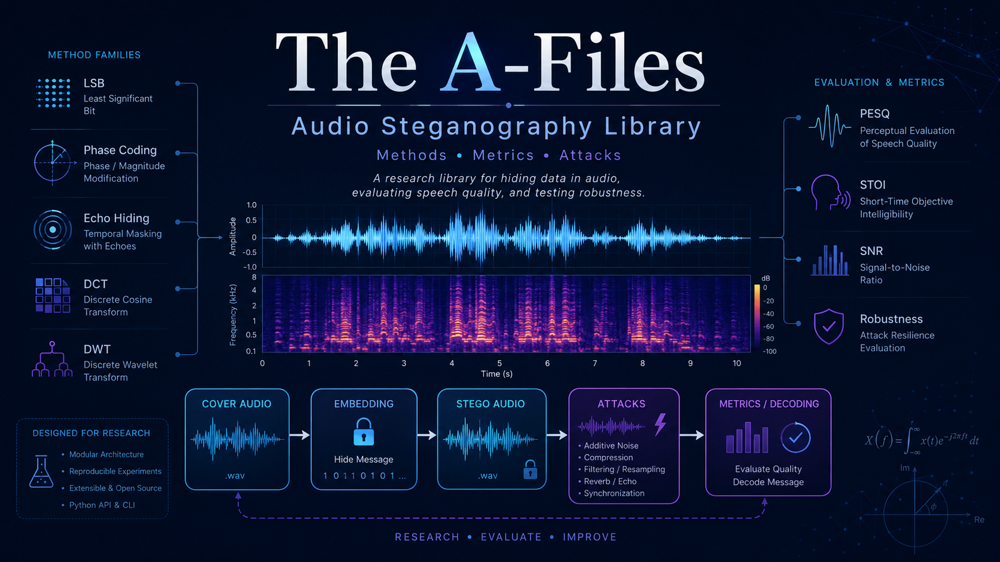

# The A-Files



> ***The A-Files is a powerful audio steganography software that allows users to embed secret data within an
audio signal, measure speech quality metrics, and test the audio signal's robustness against different types of attacks.
<br><br>With The A-Files, users can ensure that their sensitive information remains private and protected.***

## 🧭 Table of contents

* [🔎 About](#about)
* [📦 Install](#install)
* [⚡ Usage](#usage)
* [🔐 Steganography algorithms](#steganography-algorithms)
* [📊 Metrics](#metrics)
    * [🤖 AI Based](#ai-based)
    * [🏛️ Speech Reverberation](#speech-reverberation)
    * [🗣️ Speech Intelligibility](#speech-intelligibility)
    * [🎧 Speech Quality](#speech-quality)
* [🧪 Attacks](#attacks)
* [📚 References](#references)
    * [📄 Articles](#articles)
  * [🔗 Software resources](#links)
* [⚖️ Licence](#licence)
* [🧩 Dependencies](#dependencies)
* [👥 Authors](#authors)

<a id="about"></a>

## 🔎 About

The A-Files is a research-oriented toolkit for digital audio steganography and watermarking in speech signals. It
models the embedding problem as a trade-off between payload capacity, perceptual transparency, robustness against
signal processing, and bit-level decoding reliability. A typical experiment starts with a cover waveform `x[n]`, embeds
a binary payload `b` to produce a stego waveform `y[n]`, optionally applies a channel or attack transform, and then
compares the decoded payload with the original message while measuring the acoustic distortion introduced by the
embedding process.

The project provides:

* Embedding and decoding methods for time-domain, transform-domain, spread-spectrum, echo/phase, and neural approaches
* Objective speech-quality, intelligibility, reverberation, and AI-based evaluation metrics
* Audio attack operators for robustness testing under common signal-processing distortions

 

###### Loading

Audio is loaded as a discrete-time waveform together with sampling-rate and format metadata. The package supports common
uncompressed and lossless speech containers such as WAV and FLAC, including bundled VCTK and LibriSpeech samples for
repeatable experiments. Payloads are represented as binary message vectors, which lets each method expose explicit
`encode` and `decode` behavior independent of the storage format.

###### Capacity

Capacity is evaluated as the number of recoverable payload bits that can be embedded in a finite audio segment. The
implemented methods cover low-complexity LSB substitution, phase and echo coding, DCT/DWT/LWT-domain embedding,
patchwork watermarking, norm-space and SVD-based schemes, adaptive AAC/STC embedding, wireless-channel DWT-LSB, and
fixed-decoder adversarial steganography. These algorithms expose different capacity-distortion profiles and different
failure modes under compression, filtering, resampling, and synchronization changes.

###### Transparency

Transparency is measured by comparing the cover and stego signals with objective speech metrics. The library includes
energy- and spectrum-based measures such as SNR, segmental SNR, frequency-weighted segmental SNR, log-likelihood ratio,
weighted spectral slope, cepstral distance, mel-cepstral distance, and SI-SDR. It also includes perceptual and
task-oriented measures such as PESQ, STOI, CSII, NCM, wSTMI, STGI, SRMR, BSD, composite speech-enhancement metrics, and
MOSNet. Together these metrics quantify distortion, intelligibility loss, reverberation-related degradation, and
predicted mean opinion score.

###### Robustness

Robustness is tested by applying controlled signal transformations after embedding and measuring whether the payload can
still be decoded. The attack set includes additive noise, amplitude scaling, frequency cutting, filtering, cropping,
resampling, quantization, pitch shifting, and time stretching. This enables method comparisons under channel-like
degradation and adversarial removal attempts, using decode success and objective metric shifts as the primary evidence.

*Powered by some great [GitHub repositories](#links)*

<a id="install"></a>

## 📦 Install

Install the latest PyPI release:

```bash
pip install the-a-files
```

Optional AI features such as `FgasMethod` and `MosNetMetric` require TensorFlow:

```bash
pip install "the-a-files[ai]"
```

<a id="usage"></a>

## ⚡ Usage

Run the bundled evaluation workflow or import the package as `taf`:

```bash
taf-eval direct-no-metrics
taf-eval full
python -c "from taf.methods.factory import SteganographyMethodFactory; from taf.models.types import MethodType; print(SteganographyMethodFactory.get(16000, MethodType.LSB_METHOD).type())"
```

<a id="steganography-algorithms"></a>

## 🔐 Steganography algorithms

List of implemented methods:

| lp. | Name                                        | Short description                                                       | Reference         |
|-----|---------------------------------------------|-------------------------------------------------------------------------|-------------------|
| 1   | `LsbMethod.py`                              | Standard LSB coding                                                     | [[1]](#articles)  |
| 2.  | `EchoMethod.py`                             | Echo hiding with a single echo kernel                                   | [[1]](#articles)  |
| 3.  | `PhaseCodingMethod.py`                      | Phase coding technique                                                  | [[1]](#articles)  |
| 4.  | `ImprovedPhaseCodingMethod.py`              | Improved phase coding technique                                         | [[19]](#articles) |
| 5.  | `DctDeltaLsbMethod.py`                      | DCT delta LSB embedding                                                 | [[1]](#articles)  |
| 6.  | `DwtLsbMethod.py`                           | DWT-based LSB embedding                                                 | [[1]](#articles)  |
| 7.  | `DctB1Method.py`                            | First-band DCT coefficient embedding, DCT-b1                            | [[2]](#articles)  |
| 8.  | `PatchworkMultilayerMethod.py`              | Patchwork-based multilayer watermarking                                 | [[3]](#articles)  |
| 9.  | `NormSpaceMethod.py`                        | Norm-space audio watermarking                                           | [[4]](#articles)  |
| 10. | `FsvcMethod.py`                             | Frequency singular value coefficient modification, FSVC                 | [[5]](#articles)  |
| 11. | `DsssMethod.py`                             | Direct sequence spread spectrum embedding                               | [[6]](#articles)  |
| 12. | `BlindSvdMethod.py`                         | Blind SVD embedding using entropy and log-polar transformation          | [[20]](#articles) |
| 13. | `PrimeFactorInterpolatedMethod.py`          | Prime factor interpolated embedding                                     | [[21]](#articles) |
| 14. | `LwtMethod.py`                              | LWT-based embedding                                                     | [[22]](#articles) |
| 15. | `ForegroundBackgroundSegmentationMethod.py` | Foreground-background segmentation LSB, FBS-LSB                         | [[23]](#articles) |
| 16. | `FgasMethod.py`                             | Fixed-decoder network with adversarial perturbation generation, FGAS    | [[24]](#articles) |
| 17. | `AacStcMethod.py`                           | Adaptive +-1 LSB via AAC perceptual residual and syndrome-trellis codes | [[25]](#articles) |
| 18. | `WirelessDwtLsbMethod.py`                   | Wireless-channel DWT LSB message embedding                              | [[27]](#articles) |

<a id="metrics"></a>

Each method extend abstract class  ```SteganographyMethod```

```python
from abc import abstractmethod, ABC
from typing import List
import numpy as np


class SteganographyMethod(ABC):

    @abstractmethod
    def encode(self, data: np.ndarray, message: List[int]) -> np.ndarray:
        ...

    @abstractmethod
    def decode(self, data_with_watermark: np.ndarray, watermark_length: int) -> List[int]:
        ...

    @abstractmethod
    def type(self) -> str:
        ...
```

## 📊 Metrics

List of implemented metrics:

<a id="ai-based"></a>

#### 🤖 AI Based

| lp. | Name              | Short description                                          | Reference         |
|-----|-------------------|------------------------------------------------------------|-------------------|
| 1.  | `MosNetMetric.py` | MOSNet deep-learning objective voice-conversion assessment | [[16]](#articles) |

<a id="speech-reverberation"></a>

#### 🏛️ Speech Reverberation

| lp. | Name            | Short description                                     | Reference         |
|-----|-----------------|-------------------------------------------------------|-------------------|
| 2.  | `BsdMetric.py`  | Bark spectral distortion, BSD                         | [[7]](#articles)  |
| 3.  | `SrmrMetric.py` | Speech-to-reverberation modulation energy ratio, SRMR | [[10]](#articles) |

<a id="speech-intelligibility"></a>

#### 🗣️ Speech Intelligibility

| lp. | Name            | Short description                                | Reference        |
|-----|-----------------|--------------------------------------------------|------------------|
| 4.  | `CsiiMetric.py` | Coherence and speech intelligibility index, CSII | [[7]](#articles) |
| 5.  | `NcmMetric.py`  | Normalized-covariance measure, NCM               | [[7]](#articles) |
| 6.  | `StoiMetric.py` | Short-time objective intelligibility, STOI       | [[9]](#articles) |

<a id="speech-quality"></a>

#### 🎧 Speech Quality

| lp. | Name                           | Short description                                                     | Reference         |
|-----|--------------------------------|-----------------------------------------------------------------------|-------------------|
| 7.  | `SnrMetric.py`                 | Signal-to-noise ratio, SNR                                            | [[12]](#articles) |
| 8.  | `MelCepstralDistanceMetric.py` | Mel-cepstral distance measure for objective speech quality assessment | [[11]](#articles) |
| 9.  | `SnrSegMetric.py`              | Segmental signal-to-noise ratio, SNRseg                               | [[7]](#articles)  |
| 10. | `FWSnrSegMetric.py`            | Frequency-weighted segmental SNR, fwSNRseg                            | [[7]](#articles)  |
| 11. | `CepstrumDistanceMetric.py`    | Cepstrum distance objective speech quality measure, CD                | [[7]](#articles)  |
| 12. | `LlrMetric.py`                 | Log-likelihood ratio, LLR                                             | [[7]](#articles)  |
| 13. | `WssMetric.py`                 | Weighted spectral slope, WSS                                          | [[7]](#articles)  |
| 14. | `PesqMetric.py`                | Perceptual evaluation of speech quality, PESQ                         | [[8]](#articles)  |
| 15. | `CsigMetric.py`                | Composite speech signal distortion rating, Csig                       | [[13]](#articles) |
| 16. | `CovlMetric.py`                | Composite overall signal quality rating, Covl                         | [[13]](#articles) |
| 17. | `CbakMetric.py`                | Composite background-noise intrusiveness rating, Cbak                 | [[13]](#articles) |
| 18. | `WstmiMetric.py`               | Weighted spectro-temporal modulation index, wSTMI                     | [[14]](#articles) |
| 19. | `StgiMetric.py`                | Spectro-temporal glimpsing index, STGI                                | [[15]](#articles) |
| 20. | `SisdrMetric.py`               | Scale-invariant signal-to-distortion ratio, SI-SDR                    | [[17]](#articles) |
| 21. | `BSSEvalMetric.py`             | BSSEval v4 signal separation evaluation metric                        | [[18]](#articles) |

Each metric extends the abstract class `Metric`.

```python
from abc import ABC, abstractmethod
from numbers import Number

import numpy as np


class Metric(ABC):

    @abstractmethod
    def calculate(self,
                  samples_original: np.ndarray,
                  samples_processed: np.ndarray,
                  fs: int,
                  frame_len: float = 0.03,
                  overlap: float = 0.75) -> Number | np.ndarray:
        ...

    @abstractmethod
    def name(self) -> str:
        ...
```

<a id="attacks"></a>

## 🧪 Attacks

List of attack on audio samples:

* Low pass filter
* Additive noise
* Frequency filter
* Flip random samples
* Cut random samples
* Resample (downsampling, upsampling)
* Amplitude scaling
* Pitch shift
* Time stretch

<a id="references"></a>

## 📚 References

<a id="articles"></a>

#### 📄 Articles

[1] A. A. Alsabhany, A. H. Ali, F. Ridzuan, A. H. Azni, and M. R. Mokhtar, "Digital Audio Steganography: Systematic Review, Classification, and Analysis of the Current State of the Art," *Computer Science Review*, vol. 38, article 100316, 2020. [doi:10.1016/j.cosrev.2020.100316](https://doi.org/10.1016/j.cosrev.2020.100316)

[2] H. T. Hu and L. Y. Hsu, "Robust, Transparent and High-Capacity Audio Watermarking in DCT Domain," *Signal Processing*, vol. 109, pp. 226-235, 2015. [doi:10.1016/j.sigpro.2014.11.011](https://doi.org/10.1016/j.sigpro.2014.11.011)

[3] I. Natgunanathan, Y. Xiang, G. Hua, G. Beliakov, and J. Yearwood, "Patchwork-Based Multilayer Audio Watermarking," *IEEE/ACM Transactions on Audio, Speech, and Language Processing*, vol. 25, no. 11, pp. 2176-2187, 2017. [doi:10.1109/TASLP.2017.2749001](https://doi.org/10.1109/TASLP.2017.2749001)

[4] S. Saadi, A. Merrad, and A. Benziane, "Novel Secured Scheme for Blind Audio/Speech Norm-Space Watermarking by Arnold Algorithm," *Signal Processing*, vol. 154, pp. 74-86, 2019. [doi:10.1016/j.sigpro.2018.08.011](https://doi.org/10.1016/j.sigpro.2018.08.011)

[5] J. Zhao, T. Zong, Y. Xiang, L. Gao, W. Zhou, and G. Beliakov, "Desynchronization Attacks Resilient Watermarking Method Based on Frequency Singular Value Coefficient Modification," *IEEE/ACM Transactions on Audio, Speech, and Language Processing*, vol. 29, pp. 2282-2295, 2021. [doi:10.1109/TASLP.2021.3092555](https://doi.org/10.1109/TASLP.2021.3092555)

[6] R. M. Nugraha, "Implementation of Direct Sequence Spread Spectrum Steganography on Audio Data," in *Proceedings of the 2011 International Conference on Electrical Engineering and Informatics (ICEEI)*, 2011. [doi:10.1109/ICEEI.2011.6021662](https://doi.org/10.1109/ICEEI.2011.6021662)

[7] P. C. Loizou, *Speech Enhancement: Theory and Practice*, 2nd ed. CRC Press, 2013. [doi:10.1201/b14529](https://doi.org/10.1201/b14529)

[8] M. Wang, C. Boeddeker, R. G. Dantas, and A. Seelan, "PESQ (Perceptual Evaluation of Speech Quality) Wrapper for Python Users," Zenodo, 2022. [doi:10.5281/zenodo.6549559](https://doi.org/10.5281/zenodo.6549559)

[9] C. H. Taal, R. C. Hendriks, R. Heusdens, and J. Jensen, "A Short-Time Objective Intelligibility Measure for Time-Frequency Weighted Noisy Speech," in *Proceedings of ICASSP 2010*, Dallas, TX, USA, 2010. [doi:10.1109/ICASSP.2010.5495701](https://doi.org/10.1109/ICASSP.2010.5495701)

[10] T. H. Falk, C. Zheng, and W.-Y. Chan, "A Non-Intrusive Quality and Intelligibility Measure of Reverberant and Dereverberated Speech," *IEEE Transactions on Audio, Speech, and Language Processing*, vol. 18, no. 7, pp. 1766-1774, 2010. [doi:10.1109/TASL.2010.2052247](https://doi.org/10.1109/TASL.2010.2052247)

[11] R. Kubichek, "Mel-Cepstral Distance Measure for Objective Speech Quality Assessment," in *Proceedings of the IEEE Pacific Rim Conference on Communications, Computers and Signal Processing*, Victoria, BC, Canada, vol. 1, pp. 125-128, 1993. [doi:10.1109/PACRIM.1993.407206](https://doi.org/10.1109/PACRIM.1993.407206)

[12] Wikipedia contributors, "Signal-to-Noise Ratio," *Wikipedia*. [https://en.wikipedia.org/wiki/Signal-to-noise_ratio](https://en.wikipedia.org/wiki/Signal-to-noise_ratio)

[13] Y. Hu and P. C. Loizou, "Evaluation of Objective Quality Measures for Speech Enhancement," *IEEE Transactions on Audio, Speech, and Language Processing*, vol. 16, no. 1, pp. 229-238, 2008. [doi:10.1109/TASL.2007.911054](https://doi.org/10.1109/TASL.2007.911054)

[14] A. Edraki, W.-Y. Chan, J. Jensen, and D. Fogerty, "Speech Intelligibility Prediction Using Spectro-Temporal Modulation Analysis," *IEEE/ACM Transactions on Audio, Speech, and Language Processing*, vol. 29, pp. 210-225, 2021. [doi:10.1109/TASLP.2020.3039929](https://doi.org/10.1109/TASLP.2020.3039929)

[15] A. Edraki, W.-Y. Chan, J. Jensen, and D. Fogerty, "A Spectro-Temporal Glimpsing Index (STGI) for Speech Intelligibility Prediction," in *Proceedings of Interspeech 2021*, 2021. [doi:10.21437/Interspeech.2021-605](https://doi.org/10.21437/Interspeech.2021-605)

[16] C.-C. Lo, S.-W. Fu, W.-C. Huang, X. Wang, J. Yamagishi, Y. Tsao, and H.-M. Wang, "MOSNet: Deep Learning Based Objective Assessment for Voice Conversion," *arXiv preprint*, arXiv:1904.08352, 2019. [arXiv:1904.08352](https://arxiv.org/abs/1904.08352)

[17] J. Le Roux, S. Wisdom, H. Erdogan, and J. R. Hershey, "SDR - Half-Baked or Well Done?," in *Proceedings of ICASSP 2019*, 2019. [doi:10.1109/ICASSP.2019.8683855](https://doi.org/10.1109/ICASSP.2019.8683855)

[18] F.-R. Stöter, A. Liutkus, and N. Ito, "The 2018 Signal Separation Evaluation Campaign," in *Latent Variable Analysis and Signal Separation*, LVA/ICA 2018, pp. 293-305, 2018. [doi:10.5281/zenodo.3376621](https://doi.org/10.5281/zenodo.3376621)

[19] G. Yang, "An Improved Phase Coding Audio Steganography Algorithm," *arXiv preprint*, arXiv:2408.13277, 2024. [doi:10.48550/arXiv.2408.13277](https://doi.org/10.48550/arXiv.2408.13277)

[20] P. K. Dhar and T. Shimamura, "Blind SVD-Based Audio Watermarking Using Entropy and Log-Polar Transformation," *Journal of Information Security and Applications*, vol. 20, pp. 74-83, 2015. [doi:10.1016/j.jisa.2014.10.007](https://doi.org/10.1016/j.jisa.2014.10.007)

[21] F. A. Adhiyaksa, T. Ahmad, A. M. Shiddiqi, B. J. Santoso, H. Studiawan, and B. A. Pratomo, "Reversible Audio Steganography Using Least Prime Factor and Audio Interpolation," in *Proceedings of the 2021 International Seminar on Machine Learning, Optimization, and Data Science (ISMODE)*, pp. 97-102, 2022. [doi:10.1109/ISMODE53584.2022.9743066](https://doi.org/10.1109/ISMODE53584.2022.9743066)

[22] S. Mushtaq, S. Mehraj, and S. A. Parah, "Blind and Robust Watermarking Framework for Audio Signals," in *Proceedings of the 2024 11th International Conference on Reliability, Infocom Technologies and Optimization (ICRITO)*, pp. 1-5, 2024. [doi:10.1109/ICRITO61523.2024.10522195](https://doi.org/10.1109/ICRITO61523.2024.10522195)

[23] J. Wang and K. Wang, "A Novel Audio Steganography Based on the Segmentation of the Foreground and Background of Audio," *Computers & Electrical Engineering*, vol. 117, article 109247, 2025. [doi:10.1016/j.compeleceng.2024.109247](https://doi.org/10.1016/j.compeleceng.2024.109247)

[24] J. Yan, Y. Cheng, Z. Yin, X. Zhang, S. Wang, T. Sun, and X. Jiang, "FGAS: Fixed Decoder Network-Based Audio Steganography with Adversarial Perturbation Generation," *arXiv preprint*, arXiv:2505.22266, 2025. [arXiv:2505.22266](https://arxiv.org/abs/2505.22266)

[25] W. Luo, Y. Zhang, and H. Li, "Adaptive Audio Steganography Based on Advanced Audio Coding and Syndrome-Trellis Coding," in *Digital Forensics and Watermarking, IWDW 2017*, Lecture Notes in Computer Science, vol. 10431, pp. 177-186. Springer, 2017. [doi:10.1007/978-3-319-64185-0_14](https://doi.org/10.1007/978-3-319-64185-0_14)

[26] Y. Yan, Y. Li, Q. Xiao, and Y. Ren, "PRoADS: Provably Secure and Robust Audio Diffusion Steganography with Latent Optimization and Backward Euler Inversion," *arXiv preprint*, arXiv:2603.10314, 2026. [arXiv:2603.10314](https://arxiv.org/abs/2603.10314)

[27] A. A. Hamdi, A. A. Eyssa, M. I. Abdalla, M. ElAffendi, A. A. S. AlQahtani, A. A. Ateya, and R. A. Elsayed, "Improving Audio Steganography Transmission over Various Wireless Channels," *Journal of Sensor and Actuator Networks*, vol. 14, no. 6, article 106, 2025. [doi:10.3390/jsan14060106](https://doi.org/10.3390/jsan14060106)

<a id="links"></a>

#### 🔗 Software Resources

| Ref. | Project | Scope |
| --- | --- | --- |
| [1] | [audio-watermarking](https://github.com/kosta-pmf/audio-watermarking) | Audio watermarking and steganography implementation reference |
| [2] | [audio-steganography-algorithms](https://github.com/ktekeli/audio-steganography-algorithms) | Audio steganography algorithm examples |
| [3] | [pysepm](https://github.com/schmiph2/pysepm) | Objective speech enhancement and quality metrics |
| [4] | [PESQ](https://github.com/ludlows/PESQ) | Python wrapper for PESQ |
| [5] | [pystoi](https://github.com/mpariente/pystoi) | STOI implementation for Python |
| [6] | [SRMRpy](https://github.com/jfsantos/SRMRpy) | SRMR speech reverberation metric implementation |
| [7] | [mel_cepstral_distance](https://github.com/jasminsternkopf/mel_cepstral_distance) | Mel-cepstral distance implementation |
| [8] | [semetrics](https://github.com/nglehuy/semetrics) | Speech enhancement metric implementations |
| [9] | [py-intelligibility](https://github.com/aminEdraki/py-intelligibility) | Speech intelligibility metrics |
| [10] | [speechmetrics](https://github.com/aliutkus/speechmetrics) | Speech and audio evaluation metrics |
| [11] | [sigsep-mus-eval](https://github.com/sigsep/sigsep-mus-eval) | BSSEval signal separation metrics |

<a id="licence"></a>

### ⚖️ Licence

The A-Files is an open source software under GPLv3 license.

<a id="dependencies"></a>

### 🧩 Dependencies

PESQ requires Microsoft Visual C++ 14.0 or later. You can install it via Microsoft C++ Build Tools:
https://visualstudio.microsoft.com/visual-cpp-build-tools/

In some cases, you may also need FFmpeg:
https://ffmpeg.org/

<a id="authors"></a>

### 👥 Authors

- Paweł Kaczmarek ([@pawel-kaczmarek](https://github.com/pawel-kaczmarek)) - Military University of Technology,
  Faculty of Electronics
- Zbigniew Piotrowski - Military University of Technology, Faculty of Electronics
