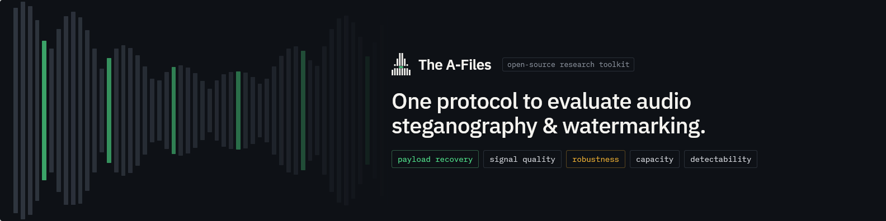
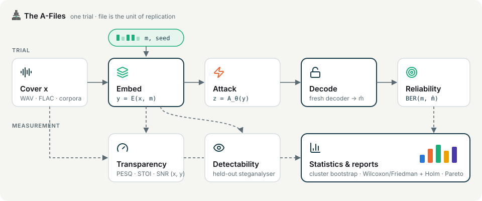

<p align="center"></p>

# The A-Files

Research toolkit for evaluating **audio steganography and watermarking**: payload recovery,
signal quality, robustness, capacity and empirical detectability under a shared experimental protocol.
Includes a Python API, declarative experiments and a browser-based research interface.

**[Documentation](https://pawelkaczmarek12.github.io/the-a-files/)** · [UI guide](docs/ui.md) · [References](docs/references.md)

<p align="center"></p>

## Quick start

Python **3.10–3.12**:

```bash
pip install the-a-files
taf-eval direct-no-metrics
```

Bundled VCTK and LibriSpeech subsets support initial experiments. FFmpeg is needed for codec attacks;
PESQ may require C++ build tools. See [installation and optional models](docs/installation.md).

## Methods · 27

- **Sample and adaptive embedding:** LSB, prime-factor interpolation, FBS-LSB, AAC-STC.
- **Transforms:** DCT-Delta-LSB, DWT-LSB, DCT-b1, norm-space, FSVC, blind SVD, LWT, wireless DWT-LSB.
- **Phase:** phase coding, improved phase coding.
- **Spread spectrum and quantisation:** DSSS, ISS, QIM / ST-DM.
- **Echo:** single echo, backward–forward echo, time-spread echo.
- **Statistical:** patchwork, histogram, low-frequency amplitude modification.
- **Neural and approximated learned schemes:** FGAS, LE-GA, AudioSeal, WavMark.

[Mechanisms, implementation limits and paper references](docs/methods.md).

## Attacks

- **Noise:** `awgn`, `pink_noise`, `impulse_noise`.
- **Coding:** `codec`, with `mp3`, `aac`, `opus`, `vorbis` shortcuts.
- **Filtering:** `low_pass`, `high_pass`, `band_pass`, `notch`, `smoothing`.
- **Sampling and quantisation:** `resample`, `clock_drift`, `bit_depth`.
- **Amplitude:** `gain`, `clipping`, `compression_dynamic`.
- **Time and pitch:** `time_shift`, `crop`, `zero_padding`, `sample_jitter`, `dropout`, `time_stretch`, `speed`, `pitch_shift`.
- **Acoustics:** `echo`, `reverb`, `acoustic_channel`.
- **Pipelines:** `streaming_upload`, `voice_call`, `broadcast`, `over_the_air`, `desync_attack`.

[Individual descriptions, parameters and scientific context](docs/attacks.md).

## Metrics · 25

- **Signal and spectral distortion:** SNR, SNRseg, fwSNRseg, WSS, LLR, CD, MCD, BSD, LSD, MRSC, SI-SDR, BSSEval v4.
- **Perceptual quality:** PESQ, ViSQOL Audio, Csig, Cbak, Covl, MOSNet.
- **Intelligibility:** CSII, NCM, STOI, eSTOI, STGI, wSTMI.
- **Reverberation-related:** SRMR.

BER, exact-message recovery, payload rate and processing time are reported separately.
[Definitions, score directions and references](docs/metrics.md).

## Research UI

From a repository checkout, start the database and API:

```bash
docker compose up -d db
pip install -e ".[platform]"
taf-api
```

In a second terminal:

```bash
cd web
npm ci
npm run dev
```

Open **http://localhost:3000**. Create an experiment, select data, methods, payloads, attacks and metrics,
review the execution plan, then start a run. Results include statistics, individual trials with audio playback,
provenance and CSV/Markdown/LaTeX exports. English and Polish are available.
[Step-by-step UI guide](docs/ui.md).

Quality is measured separately for embedding and attack damage. Published results and local measurements
remain distinct; implementation adaptations are documented in the [method catalogue](docs/methods.md).
GitHub Pages hosts the documentation; the research UI runs with the Python API and PostgreSQL.

## Licence and authors

[GPL-3.0-or-later](LICENSE). Paweł Kaczmarek and Zbigniew Piotrowski — Military University of Technology,
Faculty of Electronics. [Scientific background and bibliography](docs/references.md).
