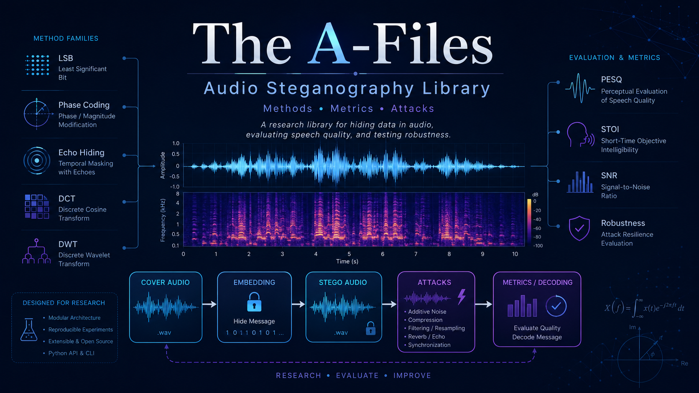

# The A-Files



> **The A-Files** (`taf`) is an open-source research toolkit for the reproducible evaluation of audio steganography and
> watermarking methods applied to speech. It provides reference implementations of embedding schemes, objective
> measures of perceptual transparency and intelligibility, a parameterised and seeded model of channel distortions and
> removal attacks, and a statistical steganalysis procedure for estimating detectability.

🇵🇱 A Polish-language guide to the structure and content of this document is available in
[docs/README.pl.md](docs/README.pl.md).

## Table of contents

1. [Scope and problem formulation](#about)
2. [Installation](#install)
3. [Usage](#usage)
4. [Experiment engine, REST API and web platform](#platform)
5. [Steganography and watermarking methods](#steganography-algorithms)
6. [Objective quality metrics](#metrics)
    1. [Data-driven (AI-based) metrics](#ai-based)
    2. [Speech reverberation](#speech-reverberation)
    3. [Speech intelligibility](#speech-intelligibility)
    4. [Speech quality](#speech-quality)
7. [Steganalysis](#steganalysis)
8. [Attack and channel model](#attacks)
9. [References](#references)
    1. [Literature](#articles)
    2. [Software resources](#links)
10. [Licence](#licence)
11. [External dependencies](#dependencies)
12. [Authors](#authors)

<a id="about"></a>

## 1. Scope and problem formulation

Information hiding in audio is governed by four mutually conflicting requirements: **payload capacity**, **perceptual
transparency**, **robustness** to signal processing, and — in the steganographic setting — **statistical
undetectability**. No single method dominates on all four axes, and published results are frequently obtained under
incomparable conditions (different corpora, payload sizes, attack parameters and metric implementations). The A-Files
addresses this by evaluating all methods under a single, fully specified experimental protocol.

Let `x[n]` denote a cover speech signal sampled at `f_s`, and `b ∈ {0,1}^L` a binary payload of length `L`. An embedding
function `E` produces the stego signal

```
y[n] = E(x[n], b),
```

which may be subjected to a channel or attack operator `A_θ` with explicit parameters `θ`, yielding `z[n] = A_θ(y[n])`.
A blind decoder `D` recovers an estimate `b̂ = D(z[n], L)` without access to the cover. Each trial is characterised by:

* **Reliability** — bit error rate `BER = (1/L) Σ 1[b_i ≠ b̂_i]` and bit accuracy `1 − BER`;
* **Transparency** — objective distortion between `x` and `y` (e.g. SNR, PESQ, STOI), computed *before* the attack so
  that embedding distortion is not confounded with attack damage;
* **Robustness** — BER as a function of the attack family and its severity `θ`;
* **Capacity** — the largest `L` for which decoding remains error-free on a segment of given duration;
* **Detectability** — held-out accuracy of a cover-versus-stego classifier (Section [7](#steganalysis)).


The toolkit comprises:

* reference implementations of 27 embedding methods spanning time-domain, transform-domain (DCT, DWT, LWT, SVD),
  spread-spectrum, quantisation-index-modulation, echo, phase and neural approaches;
* 21 objective metrics of speech quality, intelligibility and reverberation, including a learned MOS predictor;
* a library of seeded, parameterised attacks grouped by physical phenomenon, with severity presets and composite
  channel pipelines;
* a steganalysis module estimating empirical detectability;
* an asynchronous experiment engine that produces normalised, exportable result tables.

###### Signal and payload representation

Audio is represented as a discrete-time waveform with its sampling rate and container metadata. WAV, FLAC and OGG are
supported. Two public speech corpora are bundled as fixed subsets — VCTK (10 utterances) and LibriSpeech (11
utterances) — so that experiments can be repeated without external downloads. Payloads are binary vectors, which
decouples each method's `encode`/`decode` interface from the storage format.

###### Method contract

Every method is subject to an automated conformance test on real speech from the bundled VCTK subset. The test asserts
that (i) the payload is recovered bit-exactly by a *fresh* decoder instance, so no state is shared between encoder and
decoder; (ii) `encode` neither modifies the caller's cover nor changes its length; (iii) a payload exceeding the
method's capacity raises `ValueError` instead of being silently truncated; and (iv) encoding and decoding are
numerically stable on synthetic signals. Embedding strengths and quantisation steps are defined relative to signal
quantities the decoder can recompute (frame norm, band RMS, mean amplitude), which makes the methods invariant to global
gain and usable on low-level recordings.

<a id="install"></a>

## 2. Installation

The package is distributed on PyPI:

```bash
pip install the-a-files
```

Optional components are provided as extras:

| Extra | Command | Enables |
| --- | --- | --- |
| `neural` | `pip install "the-a-files[neural]"` | Pretrained neural watermarking baselines (`AudioSealMethod`, `WavMarkMethod`; PyTorch) |
| `ai` | `pip install "the-a-files[ai]"` | `FgasMethod` and `MosNetMetric` (TensorFlow ≥ 2.15) |
| `experiments` | `pip install "the-a-files[experiments]"` | Experiment engine and REST API (pandas, FastAPI, Uvicorn) |
| `dev` | `pip install -e ".[dev]"` | Test and build tooling (pytest, build, twine) |

See [External dependencies](#dependencies) for system-level prerequisites (C++ build tools, FFmpeg).

<a id="usage"></a>

## 3. Usage

The bundled evaluation workflow is exposed through the `taf-eval` entry point, which accepts the name of a packaged
scenario or a path to a YAML configuration:

```bash
taf-eval direct-no-metrics   # embedding and decoding only
taf-eval full                # embedding, attacks and all metrics
```

Individual components are available through registry-based factories:

```python
from taf.methods.factory import SteganographyMethodFactory
from taf.models.types import MethodType

method = SteganographyMethodFactory.get(16000, MethodType.LSB_METHOD)
stego = method.encode(cover, message)
decoded = method.decode(stego, len(message))
```

<a id="platform"></a>

## 4. Experiment engine, REST API and web platform

### 4.1 Experiment engine

The `taf.experiments` module defines an experiment declaratively and executes it without any user interface:

```python
from taf.experiments import ExperimentConfig, ExperimentType, run_experiment

config = ExperimentConfig(
    experiment_type=ExperimentType.DATASET_BENCHMARK,
    name="lsb-vs-fsvc-vctk",
    dataset_id="vctk",            # example | vctk | librispeech | all | upload:<id>
    file_limit=4,                 # dataset_path="C:/my/corpus" is also accepted
    methods=["LSB_METHOD", "FSVC_METHOD"],
    metrics=["SNR_METRIC", "PESQ_METRIC"],
    attacks=["additive_noise"],   # each attack is paired with a no-attack baseline
    payload_lengths=[16, 32],
    repetitions=3,
    random_seed=42,
)
run = run_experiment(config)      # per-row failures are recorded, never raised
print(run.status, run.summary["overall"])
run.to_csv("detailed_results.csv")
```

Six experimental designs share one configuration schema and one normalised result-row format (file, method, payload,
attack and its resolved parameters, BER, bit accuracy, metric values, timings, status and error):
`dataset_benchmark`, `attack_robustness`, `perceptual_quality`, `embedding_capacity`, `method_comparison` and
`research_experiment`. Derived analyses — robustness matrices, capacity thresholds and weighted multi-criteria method
rankings — are computed by `taf.experiments.scenarios`. Fixing `random_seed` makes payload generation and all stochastic
attacks reproducible.

### 4.2 REST API

```bash
uvicorn taf.api.main:app --reload   # or: taf-api
# http://127.0.0.1:8000 — interactive OpenAPI documentation at /docs
```

| Purpose | Endpoints |
| --- | --- |
| Catalogue | `GET /api/catalog/{methods,metrics,attacks,datasets}` |
| Execution | `POST /api/experiments/preview`, `POST /api/experiments/run` |
| Results | `GET /api/experiments/history`, `GET /api/experiments/{id}/{results,summary,export.csv,export_summary.csv,config.json}` |
| Progress (Server-Sent Events) | `GET /api/experiments/events`, `GET /api/experiments/{id}/events` |
| Data | `POST /api/datasets/uploads` |

### 4.3 Web dashboard

A Next.js/TypeScript dashboard in [`web/`](web/README.md) acts as a thin client of the API: it provides one view per
experimental design, live progress, summary tables and CSV export. All domain logic resides in the Python package. The
dashboard is not part of the PyPI distribution:

```bash
cd web
npm install
npm run dev   # http://localhost:3000
```

<a id="steganography-algorithms"></a>

## 5. Steganography and watermarking methods

Table 1 lists the implemented methods together with the publications on which they are based.

**Table 1.** Implemented embedding methods.

| No. | Module                                      | Method                                                                  | Ref.              |
|-----|---------------------------------------------|-------------------------------------------------------------------------|-------------------|
| 1.  | `LsbMethod.py`                              | Least-significant-bit substitution                                      | [[1]](#articles)  |
| 2.  | `EchoMethod.py`                             | Echo hiding with a single echo kernel                                   | [[1]](#articles)  |
| 3.  | `PhaseCodingMethod.py`                      | Phase coding                                                            | [[1]](#articles)  |
| 4.  | `ImprovedPhaseCodingMethod.py`              | Improved phase coding                                                   | [[19]](#articles) |
| 5.  | `DctDeltaLsbMethod.py`                      | DCT delta LSB embedding                                                 | [[1]](#articles)  |
| 6.  | `DwtLsbMethod.py`                           | DWT-domain LSB embedding                                                | [[1]](#articles)  |
| 7.  | `DctB1Method.py`                            | First-band DCT coefficient embedding (DCT-b1)                           | [[2]](#articles)  |
| 8.  | `PatchworkMultilayerMethod.py`              | Patchwork-based multilayer watermarking                                 | [[3]](#articles)  |
| 9.  | `NormSpaceMethod.py`                        | Norm-space watermarking                                                 | [[4]](#articles)  |
| 10. | `FsvcMethod.py`                             | Frequency singular value coefficient modification (FSVC)                | [[5]](#articles)  |
| 11. | `DsssMethod.py`                             | Direct-sequence spread spectrum (DSSS)                                  | [[6]](#articles)  |
| 12. | `BlindSvdMethod.py`                         | Blind SVD embedding with entropy and log-polar transformation           | [[20]](#articles) |
| 13. | `PrimeFactorInterpolatedMethod.py`          | Least-prime-factor interpolated embedding                               | [[21]](#articles) |
| 14. | `LwtMethod.py`                              | Lifting wavelet transform (LWT) embedding                               | [[22]](#articles) |
| 15. | `ForegroundBackgroundSegmentationMethod.py` | Foreground-background segmentation LSB (FBS-LSB)                        | [[23]](#articles) |
| 16. | `FgasMethod.py`                             | Fixed-decoder network with adversarial perturbation generation (FGAS)   | [[24]](#articles) |
| 17. | `AacStcMethod.py`                           | Adaptive ±1 LSB with AAC perceptual residual and syndrome-trellis codes | [[25]](#articles) |
| 18. | `WirelessDwtLsbMethod.py`                   | DWT-LSB embedding for wireless channels                                 | [[27]](#articles) |
| 19. | `LearnableEmbeddingGaMethod.py`             | Learnable embedding with genetic optimisation                           | [[28]](#articles) |
| 20. | `QimMethod.py`                              | Quantisation index modulation, spread-transform dither modulation       | [[29]](#articles) |
| 21. | `ImprovedSpreadSpectrumMethod.py`           | Improved spread spectrum with host-interference rejection               | [[30]](#articles) |
| 22. | `BackwardForwardEchoMethod.py`              | Echo hiding with backward and forward kernels                           | [[32]](#articles) |
| 23. | `TimeSpreadEchoMethod.py`                   | Time-spread echo with a pseudo-noise kernel                             | [[33]](#articles) |
| 24. | `HistogramMethod.py`                        | Histogram-based embedding robust to cropping and time-scale modification | [[34]](#articles) |
| 25. | `LowFrequencyAmplitudeMethod.py`            | Low-frequency amplitude modification (LFAM)                             | [[35]](#articles) |
| 26. | `AudioSealMethod.py`                        | AudioSeal neural watermarking (pretrained)                              | [[36]](#articles) |
| 27. | `WavMarkMethod.py`                          | WavMark neural watermarking (pretrained)                                | [[37]](#articles) |

All methods implement the abstract interface `SteganographyMethod`:

```python
from abc import abstractmethod, ABC
from typing import List
import numpy as np


class SteganographyMethod(ABC):

    @abstractmethod
    def encode(self, data: np.ndarray, message: List[int]) -> np.ndarray:
        ...

    @abstractmethod
    def decode(self, data_with_watermark: np.ndarray, watermark_length: int) -> List[int]:
        ...

    @abstractmethod
    def type(self) -> str:
        ...
```

New methods are registered in `taf/methods/factory.py` and in the `MethodType` enumeration, and must satisfy the
[method contract](#about).

<a id="metrics"></a>

## 6. Objective quality metrics

Metrics are computed between the cover `x` and the processed signal. They are grouped by the property they estimate
(Tables 2–5). Numbering is continuous across the tables.

<a id="ai-based"></a>

#### 6.1 Data-driven (AI-based) metrics

**Table 2.** Learned quality predictors.

| No. | Module            | Metric                                                     | Ref.              |
|-----|-------------------|------------------------------------------------------------|-------------------|
| 1.  | `MosNetMetric.py` | MOSNet, deep-learning mean-opinion-score prediction        | [[16]](#articles) |

<a id="speech-reverberation"></a>

#### 6.2 Speech reverberation

**Table 3.** Reverberation- and spectral-distortion measures.

| No. | Module          | Metric                                                  | Ref.              |
|-----|-----------------|---------------------------------------------------------|-------------------|
| 2.  | `BsdMetric.py`  | Bark spectral distortion (BSD)                          | [[7]](#articles)  |
| 3.  | `SrmrMetric.py` | Speech-to-reverberation modulation energy ratio (SRMR)  | [[10]](#articles) |

<a id="speech-intelligibility"></a>

#### 6.3 Speech intelligibility

**Table 4.** Intelligibility predictors.

| No. | Module          | Metric                                             | Ref.             |
|-----|-----------------|----------------------------------------------------|------------------|
| 4.  | `CsiiMetric.py` | Coherence speech intelligibility index (CSII)      | [[7]](#articles) |
| 5.  | `NcmMetric.py`  | Normalised covariance measure (NCM)                | [[7]](#articles) |
| 6.  | `StoiMetric.py` | Short-time objective intelligibility (STOI)        | [[9]](#articles) |

<a id="speech-quality"></a>

#### 6.4 Speech quality

**Table 5.** Signal-fidelity and perceptual quality measures.

| No. | Module                         | Metric                                                   | Ref.              |
|-----|--------------------------------|----------------------------------------------------------|-------------------|
| 7.  | `SnrMetric.py`                 | Signal-to-noise ratio (SNR)                              | [[12]](#articles) |
| 8.  | `MelCepstralDistanceMetric.py` | Mel-cepstral distance (MCD)                              | [[11]](#articles) |
| 9.  | `SnrSegMetric.py`              | Segmental SNR (SNRseg)                                   | [[7]](#articles)  |
| 10. | `FWSnrSegMetric.py`            | Frequency-weighted segmental SNR (fwSNRseg)              | [[7]](#articles)  |
| 11. | `CepstrumDistanceMetric.py`    | Cepstral distance (CD)                                   | [[7]](#articles)  |
| 12. | `LlrMetric.py`                 | Log-likelihood ratio (LLR)                               | [[7]](#articles)  |
| 13. | `WssMetric.py`                 | Weighted spectral slope (WSS)                            | [[7]](#articles)  |
| 14. | `PesqMetric.py`                | Perceptual evaluation of speech quality (PESQ)           | [[8]](#articles)  |
| 15. | `CsigMetric.py`                | Composite signal-distortion rating (Csig)                | [[13]](#articles) |
| 16. | `CovlMetric.py`                | Composite overall-quality rating (Covl)                  | [[13]](#articles) |
| 17. | `CbakMetric.py`                | Composite background-intrusiveness rating (Cbak)         | [[13]](#articles) |
| 18. | `WstmiMetric.py`               | Weighted spectro-temporal modulation index (wSTMI)       | [[14]](#articles) |
| 19. | `StgiMetric.py`                | Spectro-temporal glimpsing index (STGI)                  | [[15]](#articles) |
| 20. | `SisdrMetric.py`               | Scale-invariant signal-to-distortion ratio (SI-SDR)      | [[17]](#articles) |
| 21. | `BSSEvalMetric.py`             | BSSEval v4 source-separation measures                    | [[18]](#articles) |

All metrics implement the abstract interface `Metric`:

```python
from abc import ABC, abstractmethod
from numbers import Number

import numpy as np


class Metric(ABC):

    @abstractmethod
    def calculate(self,
                  samples_original: np.ndarray,
                  samples_processed: np.ndarray,
                  fs: int,
                  frame_len: float = 0.03,
                  overlap: float = 0.75) -> Number | np.ndarray:
        ...

    @abstractmethod
    def name(self) -> str:
        ...
```

<a id="steganalysis"></a>

## 7. Steganalysis

Transparency metrics quantify the perceptual cost of embedding and attacks quantify the survival of the payload, but
neither establishes whether the *presence* of a payload can be inferred — the criterion that distinguishes
steganography from watermarking. `taf.steganalysis` estimates this empirically.

Cover signals are segmented into windows; each window is paired with its stego counterpart, and the pairs are split
into disjoint training and test sets so that no cover contributes to both. Residual-Markov and log-spectral features
are extracted, and an ensemble of Fisher linear discriminants trained on random feature subspaces
[[39]](#articles) is fitted to the training set. The procedure reports test accuracy, false-positive and
false-negative rates and the out-of-bag error of the ensemble.

```python
from taf.steganalysis import measure_detectability
from taf.methods.factory import SteganographyMethodFactory
from taf.models.types import MethodType

result = measure_detectability(
    SteganographyMethodFactory.get(16000, MethodType.LSB_METHOD),
    covers,                 # mono waveforms, segmented into windows internally
    message_length=20,
)
print(result.accuracy, result.false_positive_rate, result.undetectable)
```

A test accuracy of `0.5` corresponds to chance level, i.e. the method is undetectable with respect to this feature set
(`undetectable` is `True` for accuracy ≤ 0.55); an accuracy of `1.0` indicates perfect detection. The result is a lower
bound on detectability: a negative outcome does not exclude detection by stronger features or classifiers.

<a id="attacks"></a>

## 8. Attack and channel model

Attacks model the transformations a stego signal may undergo between embedding and extraction: incidental processing,
storage and transmission, format conversion, acoustic playback and re-recording, and intentional removal attempts. Each
attack is an immutable dataclass whose fields are its parameters. Applying it returns the processed signal together
with metadata sufficient to reproduce the trial exactly.

```python
from taf.attacks import build

result = build("awgn:snr_db=20,seed=7").apply(samples, sample_rate)
result.audio
result.metadata["parameters"]      # {"snr_db": 20.0, "seed": 7, ...}
result.metadata["measured_snr_db"]
```

The following design principles are enforced:

* **Reproducibility** — all stochastic attacks use an explicit seed; the global random state is never used.
* **Explicit parameters** — a severity label (e.g. `mp3@strong`) resolves to numeric parameters that are stored in
  every result row, so results are interpretable without consulting the source code.
* **Sampling-rate awareness** — filter cut-offs and resampling targets are derived from `f_s` and validated against
  the Nyquist frequency, so a suite is equally valid at 16 kHz and 44.1 kHz.
* **No self-normalisation** — an attack never rescales its output to compensate for its own effect.

**Table 6.** Attack families.

| Family | Attacks |
| --- | --- |
| Codec | `mp3`, `aac`, `opus`, `vorbis` — real FFmpeg encode/decode round trips |
| Noise | `awgn`, `pink_noise`, `impulse_noise` — parameterised by target SNR |
| Filtering | `low_pass`, `high_pass`, `band_pass`, `notch`, `smoothing` |
| Resampling | `resample` (round trip), `clock_drift` |
| Quantisation | `bit_depth` |
| Amplitude | `gain` (dB), `clipping`, `compression_dynamic` |
| Temporal | `time_shift`, `crop`, `zero_padding`, `sample_jitter`, `dropout`, `time_stretch`, `speed`, `pitch_shift` |
| Acoustic | `echo`, `reverb`, `acoustic_channel` |
| Pipelines | `streaming_upload`, `voice_call`, `broadcast`, `over_the_air`, `desync_attack` |

An attack specification may carry explicit parameters (`"awgn:snr_db=20"`), a severity level (`"mp3@strong"`) or refer
to a composite pipeline (`"pipeline:name=voice_call"`). Predefined benchmark suites cover all families at several
severity levels:

```yaml
experiment_type: attack_robustness
attack_preset: standard     # quick | standard | full
```

Codec attacks require FFmpeg on `PATH`. The parameter rationale, an audit of the previous implementation and known
limitations are documented in [docs/attacks.md](docs/attacks.md).

<a id="references"></a>

## 9. References

<a id="articles"></a>

#### 9.1 Literature

[1] A. A. Alsabhany, A. H. Ali, F. Ridzuan, A. H. Azni, and M. R. Mokhtar, "Digital Audio Steganography: Systematic Review, Classification, and Analysis of the Current State of the Art," *Computer Science Review*, vol. 38, article 100316, 2020. [doi:10.1016/j.cosrev.2020.100316](https://doi.org/10.1016/j.cosrev.2020.100316)

[2] H. T. Hu and L. Y. Hsu, "Robust, Transparent and High-Capacity Audio Watermarking in DCT Domain," *Signal Processing*, vol. 109, pp. 226-235, 2015. [doi:10.1016/j.sigpro.2014.11.011](https://doi.org/10.1016/j.sigpro.2014.11.011)

[3] I. Natgunanathan, Y. Xiang, G. Hua, G. Beliakov, and J. Yearwood, "Patchwork-Based Multilayer Audio Watermarking," *IEEE/ACM Transactions on Audio, Speech, and Language Processing*, vol. 25, no. 11, pp. 2176-2187, 2017. [doi:10.1109/TASLP.2017.2749001](https://doi.org/10.1109/TASLP.2017.2749001)

[4] S. Saadi, A. Merrad, and A. Benziane, "Novel Secured Scheme for Blind Audio/Speech Norm-Space Watermarking by Arnold Algorithm," *Signal Processing*, vol. 154, pp. 74-86, 2019. [doi:10.1016/j.sigpro.2018.08.011](https://doi.org/10.1016/j.sigpro.2018.08.011)

[5] J. Zhao, T. Zong, Y. Xiang, L. Gao, W. Zhou, and G. Beliakov, "Desynchronization Attacks Resilient Watermarking Method Based on Frequency Singular Value Coefficient Modification," *IEEE/ACM Transactions on Audio, Speech, and Language Processing*, vol. 29, pp. 2282-2295, 2021. [doi:10.1109/TASLP.2021.3092555](https://doi.org/10.1109/TASLP.2021.3092555)

[6] R. M. Nugraha, "Implementation of Direct Sequence Spread Spectrum Steganography on Audio Data," in *Proceedings of the 2011 International Conference on Electrical Engineering and Informatics (ICEEI)*, 2011. [doi:10.1109/ICEEI.2011.6021662](https://doi.org/10.1109/ICEEI.2011.6021662)

[7] P. C. Loizou, *Speech Enhancement: Theory and Practice*, 2nd ed. CRC Press, 2013. [doi:10.1201/b14529](https://doi.org/10.1201/b14529)

[8] M. Wang, C. Boeddeker, R. G. Dantas, and A. Seelan, "PESQ (Perceptual Evaluation of Speech Quality) Wrapper for Python Users," Zenodo, 2022. [doi:10.5281/zenodo.6549559](https://doi.org/10.5281/zenodo.6549559)

[9] C. H. Taal, R. C. Hendriks, R. Heusdens, and J. Jensen, "A Short-Time Objective Intelligibility Measure for Time-Frequency Weighted Noisy Speech," in *Proceedings of ICASSP 2010*, Dallas, TX, USA, 2010. [doi:10.1109/ICASSP.2010.5495701](https://doi.org/10.1109/ICASSP.2010.5495701)

[10] T. H. Falk, C. Zheng, and W.-Y. Chan, "A Non-Intrusive Quality and Intelligibility Measure of Reverberant and Dereverberated Speech," *IEEE Transactions on Audio, Speech, and Language Processing*, vol. 18, no. 7, pp. 1766-1774, 2010. [doi:10.1109/TASL.2010.2052247](https://doi.org/10.1109/TASL.2010.2052247)

[11] R. Kubichek, "Mel-Cepstral Distance Measure for Objective Speech Quality Assessment," in *Proceedings of the IEEE Pacific Rim Conference on Communications, Computers and Signal Processing*, Victoria, BC, Canada, vol. 1, pp. 125-128, 1993. [doi:10.1109/PACRIM.1993.407206](https://doi.org/10.1109/PACRIM.1993.407206)

[12] Wikipedia contributors, "Signal-to-Noise Ratio," *Wikipedia*. [https://en.wikipedia.org/wiki/Signal-to-noise_ratio](https://en.wikipedia.org/wiki/Signal-to-noise_ratio)

[13] Y. Hu and P. C. Loizou, "Evaluation of Objective Quality Measures for Speech Enhancement," *IEEE Transactions on Audio, Speech, and Language Processing*, vol. 16, no. 1, pp. 229-238, 2008. [doi:10.1109/TASL.2007.911054](https://doi.org/10.1109/TASL.2007.911054)

[14] A. Edraki, W.-Y. Chan, J. Jensen, and D. Fogerty, "Speech Intelligibility Prediction Using Spectro-Temporal Modulation Analysis," *IEEE/ACM Transactions on Audio, Speech, and Language Processing*, vol. 29, pp. 210-225, 2021. [doi:10.1109/TASLP.2020.3039929](https://doi.org/10.1109/TASLP.2020.3039929)

[15] A. Edraki, W.-Y. Chan, J. Jensen, and D. Fogerty, "A Spectro-Temporal Glimpsing Index (STGI) for Speech Intelligibility Prediction," in *Proceedings of Interspeech 2021*, 2021. [doi:10.21437/Interspeech.2021-605](https://doi.org/10.21437/Interspeech.2021-605)

[16] C.-C. Lo, S.-W. Fu, W.-C. Huang, X. Wang, J. Yamagishi, Y. Tsao, and H.-M. Wang, "MOSNet: Deep Learning Based Objective Assessment for Voice Conversion," *arXiv preprint*, arXiv:1904.08352, 2019. [arXiv:1904.08352](https://arxiv.org/abs/1904.08352)

[17] J. Le Roux, S. Wisdom, H. Erdogan, and J. R. Hershey, "SDR - Half-Baked or Well Done?," in *Proceedings of ICASSP 2019*, 2019. [doi:10.1109/ICASSP.2019.8683855](https://doi.org/10.1109/ICASSP.2019.8683855)

[18] F.-R. Stöter, A. Liutkus, and N. Ito, "The 2018 Signal Separation Evaluation Campaign," in *Latent Variable Analysis and Signal Separation*, LVA/ICA 2018, pp. 293-305, 2018. [doi:10.5281/zenodo.3376621](https://doi.org/10.5281/zenodo.3376621)

[19] G. Yang, "An Improved Phase Coding Audio Steganography Algorithm," *arXiv preprint*, arXiv:2408.13277, 2024. [doi:10.48550/arXiv.2408.13277](https://doi.org/10.48550/arXiv.2408.13277)

[20] P. K. Dhar and T. Shimamura, "Blind SVD-Based Audio Watermarking Using Entropy and Log-Polar Transformation," *Journal of Information Security and Applications*, vol. 20, pp. 74-83, 2015. [doi:10.1016/j.jisa.2014.10.007](https://doi.org/10.1016/j.jisa.2014.10.007)

[21] F. A. Adhiyaksa, T. Ahmad, A. M. Shiddiqi, B. J. Santoso, H. Studiawan, and B. A. Pratomo, "Reversible Audio Steganography Using Least Prime Factor and Audio Interpolation," in *Proceedings of the 2021 International Seminar on Machine Learning, Optimization, and Data Science (ISMODE)*, pp. 97-102, 2022. [doi:10.1109/ISMODE53584.2022.9743066](https://doi.org/10.1109/ISMODE53584.2022.9743066)

[22] S. Mushtaq, S. Mehraj, and S. A. Parah, "Blind and Robust Watermarking Framework for Audio Signals," in *Proceedings of the 2024 11th International Conference on Reliability, Infocom Technologies and Optimization (ICRITO)*, pp. 1-5, 2024. [doi:10.1109/ICRITO61523.2024.10522195](https://doi.org/10.1109/ICRITO61523.2024.10522195)

[23] J. Wang and K. Wang, "A Novel Audio Steganography Based on the Segmentation of the Foreground and Background of Audio," *Computers & Electrical Engineering*, vol. 117, article 109247, 2025. [doi:10.1016/j.compeleceng.2024.109247](https://doi.org/10.1016/j.compeleceng.2024.109247)

[24] J. Yan, Y. Cheng, Z. Yin, X. Zhang, S. Wang, T. Sun, and X. Jiang, "FGAS: Fixed Decoder Network-Based Audio Steganography with Adversarial Perturbation Generation," *arXiv preprint*, arXiv:2505.22266, 2025. [arXiv:2505.22266](https://arxiv.org/abs/2505.22266)

[25] W. Luo, Y. Zhang, and H. Li, "Adaptive Audio Steganography Based on Advanced Audio Coding and Syndrome-Trellis Coding," in *Digital Forensics and Watermarking, IWDW 2017*, Lecture Notes in Computer Science, vol. 10431, pp. 177-186. Springer, 2017. [doi:10.1007/978-3-319-64185-0_14](https://doi.org/10.1007/978-3-319-64185-0_14)

[26] Y. Yan, Y. Li, Q. Xiao, and Y. Ren, "PRoADS: Provably Secure and Robust Audio Diffusion Steganography with Latent Optimization and Backward Euler Inversion," *arXiv preprint*, arXiv:2603.10314, 2026. [arXiv:2603.10314](https://arxiv.org/abs/2603.10314)

[27] A. A. Hamdi, A. A. Eyssa, M. I. Abdalla, M. ElAffendi, A. A. S. AlQahtani, A. A. Ateya, and R. A. Elsayed, "Improving Audio Steganography Transmission over Various Wireless Channels," *Journal of Sensor and Actuator Networks*, vol. 14, no. 6, article 106, 2025. [doi:10.3390/jsan14060106](https://doi.org/10.3390/jsan14060106)

[28] J. Nayeem, H.-B. Lee, and Y.-H. Seo, "Robust Audio Watermarking with Learnable Embedding Technique and Genetic Optimization," *Digital Signal Processing*, vol. 183, article 106372, 2026. [doi:10.1016/j.dsp.2026.106372](https://doi.org/10.1016/j.dsp.2026.106372)

[29] B. Chen and G. W. Wornell, "Quantization Index Modulation: A Class of Provably Good Methods for Digital Watermarking and Information Embedding," *IEEE Transactions on Information Theory*, vol. 47, no. 4, pp. 1423-1443, 2001. [doi:10.1109/18.923725](https://doi.org/10.1109/18.923725)

[30] H. S. Malvar and D. A. F. Florencio, "Improved Spread Spectrum: A New Modulation Technique for Robust Watermarking," *IEEE Transactions on Signal Processing*, vol. 51, no. 4, pp. 898-905, 2003. [doi:10.1109/TSP.2003.809385](https://doi.org/10.1109/TSP.2003.809385)

[31] I. J. Cox, J. Kilian, F. T. Leighton, and T. Shamoon, "Secure Spread Spectrum Watermarking for Multimedia," *IEEE Transactions on Image Processing*, vol. 6, no. 12, pp. 1673-1687, 1997. [doi:10.1109/83.650120](https://doi.org/10.1109/83.650120)

[32] H. J. Kim and Y. H. Choi, "A Novel Echo-Hiding Scheme with Backward and Forward Kernels," *IEEE Transactions on Circuits and Systems for Video Technology*, vol. 13, no. 8, pp. 885-889, 2003. [doi:10.1109/TCSVT.2003.815950](https://doi.org/10.1109/TCSVT.2003.815950)

[33] B.-S. Ko, R. Nishimura, and Y. Suzuki, "Time-Spread Echo Method for Digital Audio Watermarking," *IEEE Transactions on Multimedia*, vol. 7, no. 2, pp. 212-221, 2005. [doi:10.1109/TMM.2005.843366](https://doi.org/10.1109/tmm.2005.843366)

[34] S. Xiang and J. Huang, "Histogram-Based Audio Watermarking Against Time-Scale Modification and Cropping Attacks," *IEEE Transactions on Multimedia*, vol. 9, no. 7, pp. 1357-1372, 2007. [doi:10.1109/TMM.2007.906580](https://doi.org/10.1109/TMM.2007.906580)

[35] W.-N. Lie and L.-C. Chang, "Robust and High-Quality Time-Domain Audio Watermarking Based on Low-Frequency Amplitude Modification," *IEEE Transactions on Multimedia*, vol. 8, no. 1, pp. 46-59, 2006. [doi:10.1109/TMM.2005.861292](https://doi.org/10.1109/TMM.2005.861292)

[36] R. San Roman, P. Fernandez, H. Elsahar, A. Defossez, T. Furon, and T. Tran, "Proactive Detection of Voice Cloning with Localized Watermarking," in *Proceedings of the 41st International Conference on Machine Learning (ICML)*, 2024. [arXiv:2401.17264](https://arxiv.org/abs/2401.17264)

[37] G. Chen, Y. Wu, S. Liu, T. Liu, X. Du, and F. Wei, "WavMark: Watermarking for Audio Generation," *arXiv preprint*, arXiv:2308.12770, 2023. [arXiv:2308.12770](https://arxiv.org/abs/2308.12770)

[38] H. Liu, M. Guo, Z. Jiang, L. Wang, and N. Z. Gong, "AudioMarkBench: Benchmarking Robustness of Audio Watermarking," in *Advances in Neural Information Processing Systems 37 (NeurIPS Datasets and Benchmarks)*, 2024. [arXiv:2406.06979](https://arxiv.org/abs/2406.06979)

[39] J. Kodovsky, J. Fridrich, and V. Holub, "Ensemble Classifiers for Steganalysis of Digital Media," *IEEE Transactions on Information Forensics and Security*, vol. 7, no. 2, pp. 432-444, 2012. [doi:10.1109/TIFS.2011.2175919](https://doi.org/10.1109/TIFS.2011.2175919)

[40] T. Filler, J. Judas, and J. Fridrich, "Minimizing Additive Distortion in Steganography Using Syndrome-Trellis Codes," *IEEE Transactions on Information Forensics and Security*, vol. 6, no. 3, pp. 920-935, 2011. [doi:10.1109/TIFS.2011.2134094](https://doi.org/10.1109/TIFS.2011.2134094)

<a id="links"></a>

#### 9.2 Software resources

The following open-source projects served as references for, or are wrapped by, individual components.

| Ref. | Project | Scope |
| --- | --- | --- |
| [S1] | [audio-watermarking](https://github.com/kosta-pmf/audio-watermarking) | Audio watermarking and steganography implementations |
| [S2] | [audio-steganography-algorithms](https://github.com/ktekeli/audio-steganography-algorithms) | Audio steganography algorithm examples |
| [S3] | [pysepm](https://github.com/schmiph2/pysepm) | Objective speech enhancement and quality measures |
| [S4] | [PESQ](https://github.com/ludlows/PESQ) | Python wrapper for ITU-T P.862 PESQ |
| [S5] | [pystoi](https://github.com/mpariente/pystoi) | STOI implementation |
| [S6] | [SRMRpy](https://github.com/jfsantos/SRMRpy) | SRMR implementation |
| [S7] | [mel_cepstral_distance](https://github.com/jasminsternkopf/mel_cepstral_distance) | Mel-cepstral distance implementation |
| [S8] | [semetrics](https://github.com/nglehuy/semetrics) | Speech enhancement measures |
| [S9] | [py-intelligibility](https://github.com/aminEdraki/py-intelligibility) | wSTMI and STGI intelligibility measures |
| [S10] | [speechmetrics](https://github.com/aliutkus/speechmetrics) | Speech and audio evaluation measures |
| [S11] | [sigsep-mus-eval](https://github.com/sigsep/sigsep-mus-eval) | BSSEval v4 |

<a id="licence"></a>

## 10. Licence

The A-Files is free software distributed under the GNU General Public License, version 3 (GPLv3).

<a id="dependencies"></a>

## 11. External dependencies

* **PESQ** requires Microsoft Visual C++ 14.0 or later, available through the
  [Microsoft C++ Build Tools](https://visualstudio.microsoft.com/visual-cpp-build-tools/).
* **FFmpeg** must be available on `PATH` for codec attacks and some format conversions: <https://ffmpeg.org/>.

<a id="authors"></a>

## 12. Authors

- Paweł Kaczmarek ([@pawel-kaczmarek](https://github.com/pawel-kaczmarek)) — Military University of Technology,
  Faculty of Electronics
- Zbigniew Piotrowski — Military University of Technology, Faculty of Electronics
